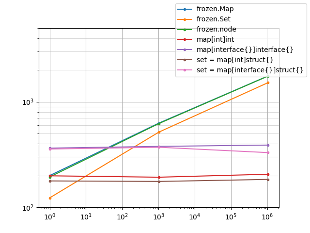

# Frozen


Efficient immutable data types.

## Types

Map and Set both use a hashed array trie.

- Map: Associates keys with values.
- Set: Stores sets of values.

## Performance

The following benchmarks test the base node implementation against several other
key-value map implementations. All implementations are tested for insertions
against an empty map, a map prepopulated with 1k elements and one prepopulated
with 1M elements. The implementations are as follows:

| Benchmark       | Type                           |
| --------------- | ------------------------------ |
| MapInt          | map[int]int                    |
| MapInterface    | map[interface{}]interface{}    |
| FrozenMap       | frozen.Map                     |
| FrozenNode      | frozen.node                    |
| SetInt          | set = map[int]struct{}         |
| SetInterface    | set = map[interface{}]struct{} |
| FrozenSet       | frozen.Set                     |

In all cases, ints are mapped to ints.

```bash
$ go test -run ^$ -cpuprofile cpu.prof -memprofile mem.prof -benchmem -bench ^BenchmarkInsert .
goos: linux
goarch: amd64
pkg: github.com/arr-ai/frozen
BenchmarkInsertMapInt0-24           	 8532830	       175 ns/op	      72 B/op	       0 allocs/op
BenchmarkInsertMapInt1k-24          	10379329	       164 ns/op	      60 B/op	       0 allocs/op
BenchmarkInsertMapInt1M-24          	 6760242	       185 ns/op	      78 B/op	       0 allocs/op
BenchmarkInsertMapInterface0-24     	 3579843	       348 ns/op	     152 B/op	       2 allocs/op
BenchmarkInsertMapInterface1k-24    	 3675631	       365 ns/op	     148 B/op	       2 allocs/op
BenchmarkInsertMapInterface1M-24    	 6517272	       354 ns/op	     115 B/op	       2 allocs/op
BenchmarkInsertFrozenMap0-24        	 5443401	       225 ns/op	     240 B/op	       6 allocs/op
BenchmarkInsertFrozenMap1k-24       	 2553954	       446 ns/op	     635 B/op	      10 allocs/op
BenchmarkInsertFrozenMap1M-24       	 1263691	       960 ns/op	     954 B/op	      13 allocs/op
BenchmarkInsertFrozenNode0-24       	 8220901	       141 ns/op	     144 B/op	       4 allocs/op
BenchmarkInsertFrozenNode1k-24      	 3294789	       388 ns/op	     539 B/op	       8 allocs/op
BenchmarkInsertFrozenNode1M-24      	 1316443	       871 ns/op	     858 B/op	      11 allocs/op
BenchmarkInsertSetInt0-24           	12816358	       155 ns/op	      29 B/op	       0 allocs/op
BenchmarkInsertSetInt1k-24          	12738687	       155 ns/op	      29 B/op	       0 allocs/op
BenchmarkInsertSetInt1M-24          	 7613054	       171 ns/op	      39 B/op	       0 allocs/op
BenchmarkInsertSetInterface0-24     	 5121948	       302 ns/op	      58 B/op	       1 allocs/op
BenchmarkInsertSetInterface1k-24    	 5051988	       303 ns/op	      58 B/op	       1 allocs/op
BenchmarkInsertSetInterface1M-24    	 3172472	       329 ns/op	      62 B/op	       1 allocs/op
BenchmarkInsertFrozenSet0-24        	 5400745	       236 ns/op	     296 B/op	       6 allocs/op
BenchmarkInsertFrozenSet1k-24       	 2460313	       512 ns/op	     787 B/op	      11 allocs/op
BenchmarkInsertFrozenSet1M-24       	 1132215	      1046 ns/op	    1106 B/op	      14 allocs/op
PASS
ok  	github.com/arr-ai/frozen	65.909s
```


