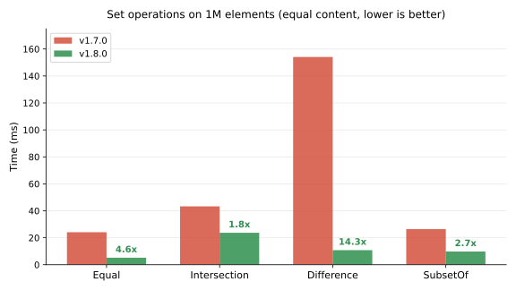
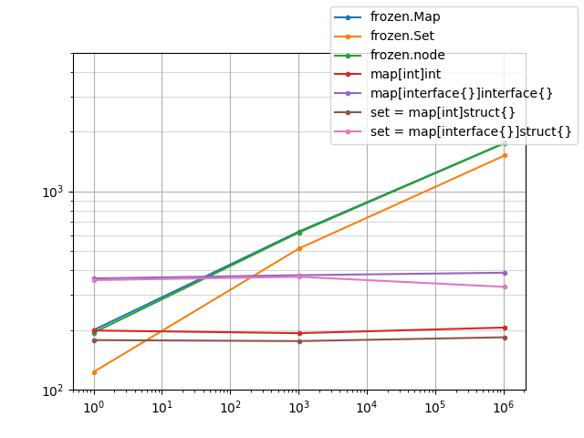

# Frozen


Efficient immutable data types.

## Overview

`frozen` is a Go 1.19+ library of immutable, persistent data structures built on hashed array tries (HAT). All mutation operations return a new value that shares structure with the original; no existing value is ever modified. The library uses Go generics throughout.

```
go get github.com/arr-ai/frozen
```

## Types

### `Set[T any]`

An immutable set backed by a hashed array trie.

Key operations: `With`, `Without`, `Has`, `Union`, `Intersection`, `Difference`, `SymmetricDifference`, `Where`, `Reduce`, `Reduce2`, `IsSubsetOf`.

Package-level functions: `Powerset[T]`, `SetMap[T, U]`, `SetGroupBy[T, K]`, `SetAs[U, T]`.

```go
import "github.com/arr-ai/frozen"

s := frozen.NewSet(1, 2, 3)
s2 := s.With(4).Without(2)       // {1, 3, 4}
fmt.Println(s2.Has(3))           // true
fmt.Println(s2.Count())          // 3

evens := s2.Where(func(n int) bool { return n%2 == 0 }) // {4}

u := s.Union(frozen.NewSet(3, 4, 5))         // {1, 2, 3, 4, 5}
d := s.Difference(frozen.NewSet(2, 3))       // {1}

sum, _ := s.Reduce2(func(a, b int) int { return a + b }) // 6
```

### `Map[K any, V any]`

An immutable key-value map backed by a hashed array trie.

Key operations: `With`, `Without`, `Get`, `MustGet`, `GetElse`, `Has`, `Keys`, `Values`, `Where`, `Merge`, `Update`, `Project`.

Package-level functions: `MapMap[K, V, U]`, `NewMapFromKeys`, `NewMapFromGoMap`, `MapToGoMap`.

```go
m := frozen.NewMap(frozen.KV("a", 1), frozen.KV("b", 2))
m2 := m.With("c", 3).Without("a")   // (b: 2, c: 3)

if v, ok := m2.Get("b"); ok {
    fmt.Println(v) // 2
}

doubled := frozen.MapMap(m, func(k string, v int) int { return v * 2 })

merged := m.Merge(m2, func(k string, a, b int) int { return a + b })
```

### `IntSet[I integer]`

A specialised immutable set for integer types, using 64-bit bitmap compression to pack values into cells. More memory-efficient than `Set[int]` for dense integer ranges.

The `integer` constraint covers `~int | ~int8 | ~int16 | ~int32 | ~int64 | ~uint | ~uint8 | ~uint16 | ~uint32 | ~uint64 | ~uintptr`.

Key operations: `With`, `Without`, `Has`, `Union`, `Intersection`, `Where`, `Map`, `IsSubsetOf`.

```go
s := frozen.NewIntSet(1, 2, 3, 100, 101)
fmt.Println(s.Has(100))              // true
fmt.Println(s.Count())               // 5
u := s.Union(frozen.NewIntSet(3, 4)) // {1, 2, 3, 4, 100, 101}
```

### `Key[T any]`

A constraint interface that types must satisfy to be usable as custom map keys or set elements with value-based equality:

```go
type Key[T any] interface {
    value.Equaler[T]   // Equal(T) bool
    hash.Hashable      // Hash(seed uintptr) uintptr
}
```

`Set[T]` and `Map[K, V]` themselves implement `Key`, so they can be nested.

### Builders

Builders accumulate elements incrementally and are more efficient than repeated `With` calls when constructing large collections.

```go
// SetBuilder
b := frozen.NewSetBuilder[string](16)
b.Add("x")
b.Add("y")
s := b.Finish() // immutable Set[string]; builder is reset

// MapBuilder
mb := frozen.NewMapBuilder[string, int](16)
mb.Put("a", 1)
mb.Put("b", 2)
m := mb.Finish() // immutable Map[string, int]
```

`Finish()` returns the immutable result and resets the builder for reuse.

## Subpackages

### `lazy/`

A `Set` interface for deferred evaluation with memoization. Operations such as `Union`, `Intersection`, `Difference`, `Where`, and `Powerset` are composed lazily and only evaluated when elements are accessed. Useful for constructing large set expressions without paying the full construction cost up front.

### `pkg/rel/`

Relational algebra built on `frozen.Map` and `frozen.Set`:

```go
type Tuple    = frozen.Map[string, any]
type Relation = frozen.Set[Tuple]
```

Provided operations: `New`, `Join`, `CartesianProduct`, `Project`, `Nest`, `Unnest`.

```go
r := rel.New(
    []string{"name", "age"},
    []any{"alice", 30},
    []any{"bob", 25},
)
names := rel.Project(r, "name")
```

## Performance

v1.8.0 introduces two optimizations to the HAMT internals:

1. **Recursive XOR hash (h0)**: Every node caches the XOR of its elements' hashes. Set operations that discover mismatched h0 values reject entire subtrees without traversal, turning O(n) comparisons into O(1).

2. **Allocation reduction**: Hash function caching moved from `sync.Map` to direct function pointers; spine operations batched to reduce intermediate allocations.

### Set operations on 1M elements (equal content)

Two independently constructed sets with identical elements — the fairest
apples-to-apples comparison (no pointer shortcuts).



**h0 early rejection**: When sets have *different* content, `Equal` on 1M-element sets drops from ~25 us to ~50 ns — over **500x faster** — because the h0 hash mismatch is detected at the root without any traversal.

**Trade-off**: Single-element `Has` is ~20-60% slower due to h0 bookkeeping overhead. The bulk-operation gains more than compensate in typical workloads.

<details>
<summary>Full benchstat comparison (v1.7.0 vs v1.8.0)</summary>

Benchmarks on Apple M4 Max, Go 1.23, darwin/arm64. Each row is the median of
6 runs. "Same" = identical pointer, "Equal" = independently built with same
elements, "Half" = 50% overlap, "Disjoint" = no overlap.

```
                                    │   v1.7.0    │              v1.8.0               │
                                    │   sec/op    │    sec/op     vs base              │
SetOps/Equal/1ki/Same                  24.46µ ± 7%   11.16µ ± 39%  -54.37% (p=0.002)
SetOps/Equal/1ki/Equal                26.027µ ±104%   6.905µ ±  1%  -73.47% (p=0.002)
SetOps/Equal/1ki/Half                  94.74n ±234%   41.38n ± 56%  -56.32% (p=0.002)
SetOps/Equal/1ki/Disjoint             101.50n ±  4%   53.96n ±  6%  -46.84% (p=0.002)
SetOps/Equal/1Mi/Same                 11.282m ± 88%   6.443m ± 21%  -42.90% (p=0.002)
SetOps/Equal/1Mi/Equal                24.060m ±  8%   5.238m ± 21%  -78.23% (p=0.002)
SetOps/Equal/1Mi/Half               32035.50n ± 25%   51.16n ± 10%  -99.84% (p=0.002)
SetOps/Equal/1Mi/Disjoint           24611.00n ± 22%   46.48n ± 12%  -99.81% (p=0.002)
SetOps/Intersection/1ki/Same           69.66µ ± 11%   34.59µ ±  6%  -50.34% (p=0.002)
SetOps/Intersection/1ki/Equal          68.20µ ±  8%   34.56µ ±  4%  -49.33% (p=0.002)
SetOps/Intersection/1ki/Half           48.33µ ±  1%   45.75µ ± 28%   -5.32% (p=0.002)
SetOps/Intersection/1ki/Disjoint       34.84µ ±  2%   25.27µ ±  6%  -27.48% (p=0.002)
SetOps/Intersection/1Mi/Same           30.51m ± 18%   21.48m ± 14%  -29.60% (p=0.002)
SetOps/Intersection/1Mi/Equal          43.28m ± 19%   23.68m ± 17%  -45.29% (p=0.002)
SetOps/Intersection/1Mi/Half           37.91m ± 10%   18.81m ± 19%  -50.37% (p=0.002)
SetOps/Intersection/1Mi/Disjoint      27.347m ± 12%   8.694m ± 87%  -68.21% (p=0.002)
SetOps/Difference/1ki/Same             81.38µ ± 26%   19.01µ ±  7%  -76.64% (p=0.002)
SetOps/Difference/1ki/Equal            67.11µ ± 18%   19.17µ ±  3%  -71.43% (p=0.002)
SetOps/Difference/1ki/Half             58.90µ ±  4%   34.58µ ± 19%  -41.29% (p=0.002)
SetOps/Difference/1ki/Disjoint         37.50µ ±  9%   37.07µ ±  7%        ~ (p=0.937)
SetOps/Difference/1Mi/Same           118.701m ± 13%   8.861m ± 17%  -92.54% (p=0.002)
SetOps/Difference/1Mi/Equal           154.07m ± 14%   10.77m ± 18%  -93.01% (p=0.002)
SetOps/Difference/1Mi/Half            156.68m ± 15%   15.01m ±  8%  -90.42% (p=0.002)
SetOps/Difference/1Mi/Disjoint        109.13m ± 18%   11.78m ± 25%  -89.21% (p=0.002)
SetOps/SubsetOf/1ki/Same               42.39µ ± 10%   12.34µ ± 10%  -70.89% (p=0.002)
SetOps/SubsetOf/1ki/Equal              40.50µ ±  2%   13.27µ ±  4%  -67.24% (p=0.002)
SetOps/SubsetOf/1ki/Half               144.1n ±  2%   150.5n ± 24%   +4.51% (p=0.009)
SetOps/SubsetOf/1ki/Disjoint           143.8n ±  3%   165.7n ± 21%  +15.19% (p=0.002)
SetOps/SubsetOf/1Mi/Same              20.894m ± 18%   9.031m ± 13%  -56.77% (p=0.002)
SetOps/SubsetOf/1Mi/Equal             26.378m ± 19%   9.771m ± 31%  -62.96% (p=0.002)
SetOps/SubsetOf/1Mi/Half               30.88µ ± 36%   32.31µ ±  7%        ~ (p=0.485)
SetOps/SubsetOf/1Mi/Disjoint           27.86µ ±  8%   27.40µ ± 21%        ~ (p=0.240)
SetOps/Has/1ki/Hit                     41.00n ±  5%   65.93n ±  2%  +60.82% (p=0.002)
SetOps/Has/1ki/Miss                    39.31n ±  1%   63.00n ±  1%  +60.28% (p=0.002)
SetOps/Has/1Mi/Hit                     204.8n ±  3%   244.8n ± 10%  +19.51% (p=0.002)
SetOps/Has/1Mi/Miss                    139.3n ±  7%   210.9n ± 19%  +51.35% (p=0.002)
geomean                                110.9µ          38.15µ        -65.61%
```

</details>

<details>
<summary>Legacy insertion benchmarks (pre-generics)</summary>

> These benchmarks were recorded before the generics rewrite. Relative ordering
> remains indicative but absolute numbers will differ on current hardware and
> Go versions.

| Benchmark       | Type                           |
| --------------- | ------------------------------ |
| MapInt          | map[int]int                    |
| MapInterface    | map[any]any                    |
| FrozenMap       | frozen.Map                     |
| FrozenNode      | frozen.node                    |
| SetInt          | set = map[int]struct{}         |
| SetInterface    | set = map[any]struct{}         |
| FrozenSet       | frozen.Set                     |

```bash
$ go test -run ^$ -cpuprofile cpu.prof -memprofile mem.prof -benchmem -bench ^BenchmarkInsert .
goos: linux
goarch: amd64
pkg: github.com/arr-ai/frozen
BenchmarkInsertMapInt0-24           	 8532830	       175 ns/op	      72 B/op	       0 allocs/op
BenchmarkInsertMapInt1k-24          	10379329	       164 ns/op	      60 B/op	       0 allocs/op
BenchmarkInsertMapInt1M-24          	 6760242	       185 ns/op	      78 B/op	       0 allocs/op
BenchmarkInsertMapInterface0-24     	 3579843	       348 ns/op	     152 B/op	       2 allocs/op
BenchmarkInsertMapInterface1k-24    	 3675631	       365 ns/op	     148 B/op	       2 allocs/op
BenchmarkInsertMapInterface1M-24    	 6517272	       354 ns/op	     115 B/op	       2 allocs/op
BenchmarkInsertFrozenMap0-24        	 5443401	       225 ns/op	     240 B/op	       6 allocs/op
BenchmarkInsertFrozenMap1k-24       	 2553954	       446 ns/op	     635 B/op	      10 allocs/op
BenchmarkInsertFrozenMap1M-24       	 1263691	       960 ns/op	     954 B/op	      13 allocs/op
BenchmarkInsertFrozenNode0-24       	 8220901	       141 ns/op	     144 B/op	       4 allocs/op
BenchmarkInsertFrozenNode1k-24      	 3294789	       388 ns/op	     539 B/op	       8 allocs/op
BenchmarkInsertFrozenNode1M-24      	 1316443	       871 ns/op	     858 B/op	      11 allocs/op
BenchmarkInsertSetInt0-24           	12816358	       155 ns/op	      29 B/op	       0 allocs/op
BenchmarkInsertSetInt1k-24          	12738687	       155 ns/op	      29 B/op	       0 allocs/op
BenchmarkInsertSetInt1M-24          	 7613054	       171 ns/op	      39 B/op	       0 allocs/op
BenchmarkInsertSetInterface0-24     	 5121948	       302 ns/op	      58 B/op	       1 allocs/op
BenchmarkInsertSetInterface1k-24    	 5051988	       303 ns/op	      58 B/op	       1 allocs/op
BenchmarkInsertSetInterface1M-24    	 3172472	       329 ns/op	      62 B/op	       1 allocs/op
BenchmarkInsertFrozenSet0-24        	 5400745	       236 ns/op	     296 B/op	       6 allocs/op
BenchmarkInsertFrozenSet1k-24       	 2460313	       512 ns/op	     787 B/op	      11 allocs/op
BenchmarkInsertFrozenSet1M-24       	 1132215	      1046 ns/op	    1106 B/op	      14 allocs/op
PASS
ok  	github.com/arr-ai/frozen	65.909s
```



</details>
