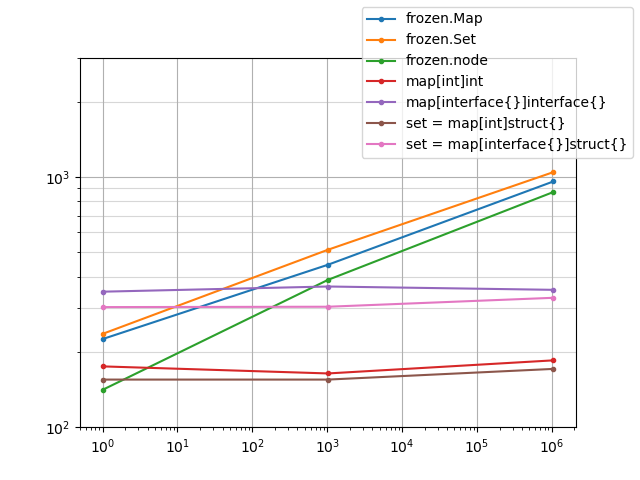

# Frozen

Efficient immutable data types.

## Types

Map and Set both use a [hashed array map trie
(HAMT)][1].

- Map: Associates keys with values.
- Set: Stores sets of values.

## Performance

The following benchmarks test the base HAMT implementation against several other
key-value map implementations. All implementations are tested for insertions
against an empty map and a map prepopulated with one million elements, except
for github.com/mediocregopher/seq, which only has 10k elements prepopulated to
avoid timeouts. In order of appearance in the benchmark (fastest to
slowest) the implementations are as follows:

1. `map[int]int`
2. `map[interface{}]interface{}`
3. `github.com/marcelocantos/frozen/pkg/frozen` (this library's HAMT)
4. `github.com/mediocregopher/seq`

In all cases, ints are mapped to ints.

```
BenchmarkInsertMapInt0-8          	 5082399	       236 ns/op	      69 B/op	       0 allocs/op
BenchmarkInsertMapInt1M-8         	 5285689	       204 ns/op	      53 B/op	       0 allocs/op
BenchmarkInsertMapInterface0-8    	 2111479	       533 ns/op	     170 B/op	       2 allocs/op
BenchmarkInsertMapInterface1M-8   	 3187671	       606 ns/op	     169 B/op	       2 allocs/op
BenchmarkInsertFrozen0-8          	 1000000	      1865 ns/op	    1028 B/op	      11 allocs/op
BenchmarkInsertFrozen1M-8         	  746131	      2001 ns/op	    1103 B/op	      11 allocs/op
BenchmarkInsertMediocre0-8        	   14637	    118630 ns/op	   73455 B/op	     463 allocs/op
BenchmarkInsertMediocre10k-8      	    9183	    261775 ns/op	  146185 B/op	     917 allocs/op
```


[](https://docs.google.com/spreadsheets/d/1Sq48pT4sKLHx2uY_nSljfbFpEJijXhNAeoB-BbDlrsI/edit?usp=sharing)

## Bugs

Test coverage is sparse.


[1]: https://en.wikipedia.org/wiki/Hash_array_mapped_trie
